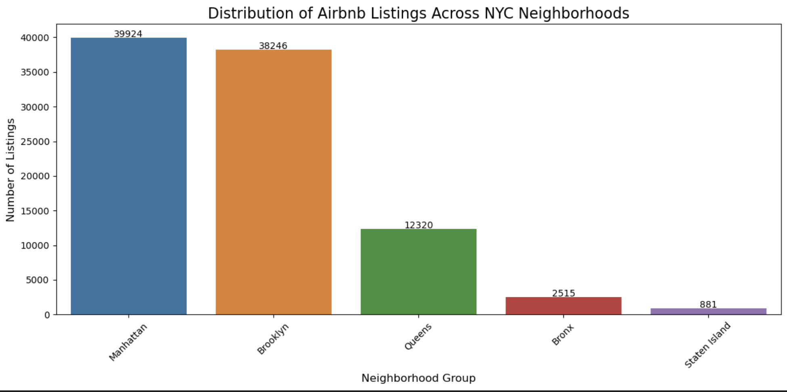
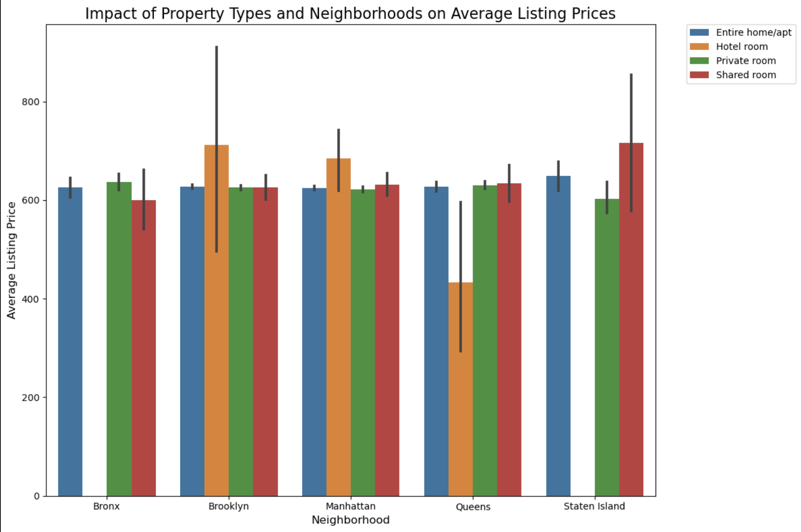
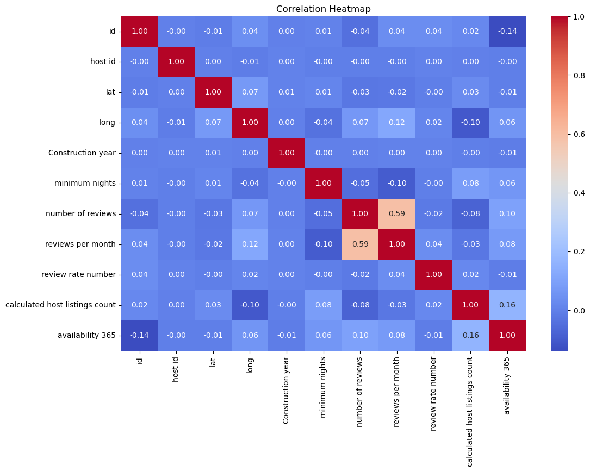

# Analyzing-Airbnb-Market-Trends-in-New-York-City

# 🏠 New York Airbnb Analysis  

## 📌 Project Overview  
This project analyzes Airbnb listings in New York City to understand trends in pricing, availability, and customer reviews. Using data analytics techniques, we explore key factors that impact the short-term rental market.  

---

## 📂 Table of Contents  
- [Introduction](#introduction)  
- [Dataset Information](#dataset-information)  
- [Features](#features)  
- [Installation](#installation)  
- [Usage](#usage)  
- [Analysis Process](#analysis-process)  
  - [Exploratory Data Analysis (EDA)](#exploratory-data-analysis-eda)  
  - [Data Cleaning](#data-cleaning)  
  - [Key Findings](#key-findings)  
- [Visualizations](#visualizations)  
- [Results & Findings](#results--findings)  
- [Future Scope](#future-scope)  
- [Contributors](#contributors)  
- [License](#license)  
- [References](#references)  

---

## 📖 Introduction  
Airbnb has transformed the hospitality industry by offering flexible accommodation options. This project investigates the factors influencing Airbnb prices, availability, and reviews in New York City. Our objective is to provide insights that help both hosts and guests make informed decisions.  

---

## 📊 Dataset Information  
- **Source:** [Airbnb Open Data (Kaggle)](https://www.kaggle.com/)  
- **Key Columns:**  
  - Property Type  
  - Neighborhood  
  - Price  
  - Availability  
  - Review Scores  
  - Cancellation Policy  

---

## 🚀 Features  
✅ Pricing trends across different boroughs  
✅ Relationship between availability and booking trends  
✅ Impact of cancellation policies on customer reviews  
✅ Influence of property type on pricing  

---
---

# 🔍 Exploratory Data Analysis (EDA)  

## 📌 Objective  
The goal of our EDA is to uncover insights about Airbnb listings in New York City by analyzing factors such as price distribution, availability trends, and customer reviews.  

---

## 📊 Data Cleaning & Preprocessing  

✔️ Removed duplicate and irrelevant columns.  
✔️ Handled missing values in price, review scores, and availability fields.  
✔️ Standardized categorical variables (e.g., property types, borough names).  
✔️ Identified and treated outliers in the price column.  

---

## 📈 Visualizations  

### 1️⃣ **Price Distribution Across Boroughs**  
Airbnb prices vary significantly by borough, with Manhattan being the most expensive.  

  

**Observations:**  
- **Manhattan** has the highest median price.  
- **The Bronx** offers the most affordable listings.  
- Prices are skewed with a few high-priced outliers.  

---

### 2️⃣ **Room Type & Pricing Trends**  
Understanding how different room types impact pricing.  

  

**Observations:**  
- **Entire homes/apartments** have the highest average prices.  
- **Private rooms** are significantly cheaper.  
- **Shared rooms** make up a very small portion of listings.  

---

### 3️⃣ **Seasonal Trends in Availability**  
Availability of listings fluctuates throughout the year.  

**Observations:**  
- **Peak seasons** (summer months) show increased availability.  
- **Winter months** have fewer listings available.  
- Hosts may adjust pricing based on demand.  

---

### 4️⃣ **Cancellation Policy vs. Review Scores**  
How cancellation policies impact customer satisfaction.  

**Observations:**  
- **Flexible policies** tend to have higher review scores.  
- **Strict policies** may lead to lower customer satisfaction.  
- Guests prefer hosts with **lenient cancellation policies**.  

---

### 5️⃣ **Correlation Analysis**  
Examining relationships between features.  

  

**Observations:**  
- Price is weakly correlated with **review scores**.  
- Higher prices are found in **high-demand neighborhoods**.  
- **Availability and number of reviews** show some correlation.  

---

## 🔥 Key Findings  

✅ **Neighborhood & Property Type Matter**  
   - Listings in **Manhattan** are the most expensive.  
   - **Entire homes** cost more than private/shared rooms.  

✅ **Seasonality Affects Availability**  
   - Airbnb availability **peaks in summer months**.  
   - Lower demand in winter leads to fewer listings.  

✅ **Cancellation Policies Influence Reviews**  
   - **Flexible policies** result in higher guest satisfaction.  
   - **Strict policies** may discourage bookings.  

✅ **Price & Reviews Are Weakly Correlated**  
   - Higher prices don’t necessarily mean better reviews.  
   - Other factors like location, amenities, and host interaction impact ratings.  

---

This detailed **Exploratory Data Analysis (EDA)** provided valuable insights into Airbnb trends in NYC. We will leverage these findings for further analysis and predictive modeling.  

---

## ⚙️ Installation  
To set up this project on your local machine:  

```bash
# Clone the repository
git clone https://github.com/your-username/your-repo-name.git

# Navigate to the project folder
cd your-repo-name

# Install required dependencies
pip install -r requirements.txt
